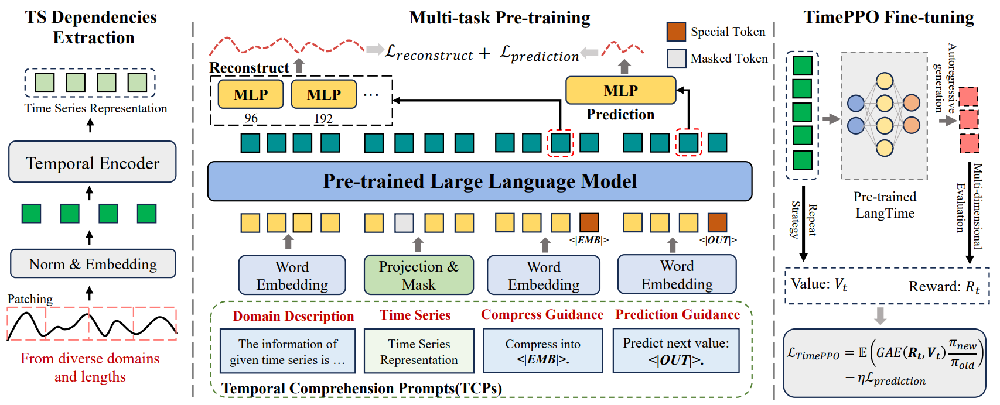

# LangTime: A Language-Guided Unified Model for Time Series Forecasting with Proximal Policy Optimization

[](https://arxiv.org/abs/2503.08271)

## Overview
<div align="center">
  
</div>
<br>


## Datasets
You can access the well pre-processed datasets from [[Google Drive]](https://drive.google.com/file/d/1NF7VEefXCmXuWNbnNe858WvQAkJ_7wuP/view?usp=sharing).
Please download the contents and place them under the `./dataset` directory in the project root.

## LLM Backbones
LangTime is designed to be compatible with various pre-trained Large Language Models (LLMs) as its backbone for time series forecasting. Currently, we officially support the following models:

*   **Qwen2-0.5B-Instruct**: [[Hugging Face]](https://huggingface.co/Qwen/Qwen2-0.5B-Instruct)
    Please download the model contents and place them under the `./llm/qwen2` directory in the project root.
*   **GPT2**: [[Hugging Face]](https://huggingface.co/openai-community/gpt2)
    To use GPT2 as the backbone, please download its model files and place them accordingly (e.g., under `./llm/gpt2`).

## Usage
To get started with LangTime, follow these steps:

### Installation
First, clone the repository and navigate to the project directory:
```bash
git clone https://github.com/niuwz/LangTime.git
cd LangTime
```

Then, install the required dependencies. It's recommended to use a virtual environment, for example, using Conda:
```bash
conda create -n langtime python=3.10
conda activate langtime
pip install -r requirements.txt
```

### Running Examples
You can run an example script to see LangTime in action. For instance, to train a model on a sample dataset:
```bash
bash scripts/single_domain/ETTh1.sh
```


## Acknowledgement
Our implementation adapts [Time-Series-Library](https://github.com/thuml/Time-Series-Library) as the code base and have extensively modified it to our purposes. We thank the authors for sharing their implementations and related resources.

## Citation
If you find our work useful, please consider citing:

```bibtex
@article{niu2025langtime,
  title={LangTime: A Language-Guided Unified Model for Time Series Forecasting with Proximal Policy Optimization},
  author={Niu, Wenzhe and Xie, Zongxia and Sun, Yanru and He, Wei and Xu, Man and Hao, Chao},
  journal={arXiv preprint arXiv:2503.08271},
  year={2025}
}
```

## Contact
If you have any questions or suggestions, feel free to open an issue or contact us via niuwenzhe@tju.edu.cn